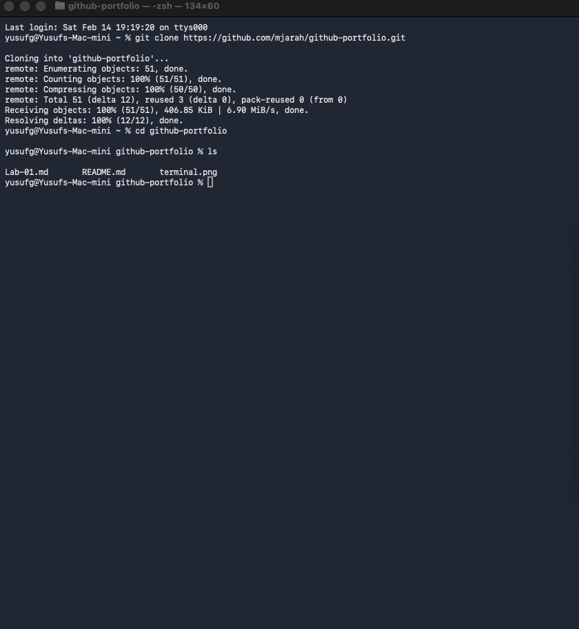

# Lab 01: Infrastructure Audit
**Name:** Mohammed Jarah
**Date:** 2026-02-14
**Status:** Completed

## 🎯 Objective
To document the 2021 Facebook outage and practice using GitHub for enterprise documentation.

## 🔍 Key Findings (Case Study)
1.  **The Event:** Facebook (Meta) disappeared from the internet because of a configuration error.
2.  **The Technical Cause:** A bad command deleted the BGP (Border Gateway Protocol) routes.
3.  **The Impact:** DNS resolvers could not find Facebook's servers.

## 📸 Proof of Work

## 🤝 GitHub Network

### Following (5+)
* [@classmate1] ([https://github.com/classmate](https://github.com/nindyyc22-wq)1)
* [@classmate2] ([https://github.com/classmate2](https://github.com/tevaristrange32-tech))
* [@classmate3] ([https://github.com/classmate3](https://github.com/Hashem811))
* [@classmate4] ([https://github.com/classmate4](https://github.com/Hammad1012))
* [@classmate5] ([https://github.com/classmate5](https://github.com/abdullahaldosariy))

### Forked Repositories (2+)
1. **[Awesome-Cybersecurity](https://github.com/sbilly/awesome-cybersecurity)** by @sbilly
   - Description: A collection of software, libraries, and resources for cybersecurity.
   - Relevance: Provides a high-quality toolkit for my future security lab work.

2. **[CheatSheetSeries](https://github.com/OWASP/CheatSheetSeries)** by @OWASP
   - Description: Security-focused guides for developers and engineers.
   - Relevance: Useful for understanding system hardening and perimeter security protocols.
